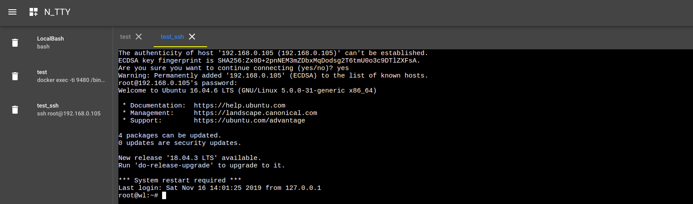

#### NTTY

ntty提供通过远程终端操作Linux 。

使用举例:

>

**使用步骤**

>**注册帐号，获取Token**
>
>>访问`http://www.wl119.club/`注册帐号:
>>
>>
>>
>>使用注册的帐号密码登录，获取Token:
>>
>>
>
>**获取ntty**
>
>>**下载**
>>
>>>下载
>>>
>>>```
>>>链接: https://github.com/wanglu119/ntty/releases
>>>```
>>>
>>>使用:
>>>
>>>```
>>>./ntty -authToken 3d3a14754dec25b817389b3c2d36679f6c81080c6252ade3b9815a584f28e1ae
>>>```
>>>
>>>
>>
>>
>>
>>**使用镜像**
>>
>>>获取镜像
>>>
>>>```
>>>docker pull wanglu119/tools:wl_ntty_latest
>>>```
>>>
>>>运行:
>>>
>>>```
>>>docker run --restart always -d --net=host --name ntty \
>>>-v /tmp:/tmp \
>>>wanglu119/tools:wl_ntty_latest \
>>>/code/ntty -authToken 3d3a14754dec25b817389b3c2d36679f6c81080c6252ade3b9815a584f28e1ae
>>>```
>>>
>>>
>>
>>
>
>**使用**
>
>>使用帐号登录`http://www.wl119.club/control`可以看到启动的ntty:
>>
>>
>>
>>点击ntty，跳转到创建终端的界面，点击添加可以创建终端:
>>
>>
>>
>>上面创建一个终端执行docker 命令:`docker exec -ti 9480 /bin/bash`。
>>
>>
>>
>>双击**test**，打开终端，可以执行Linux命令。
>>
>>也可以创建执行ssh的终端: `ssh root@192.168.0.105`
>>
>>
>>
>>
>>
>>双击**test_ssh**，打开终端:
>>
>>
>>
>>
>
>


